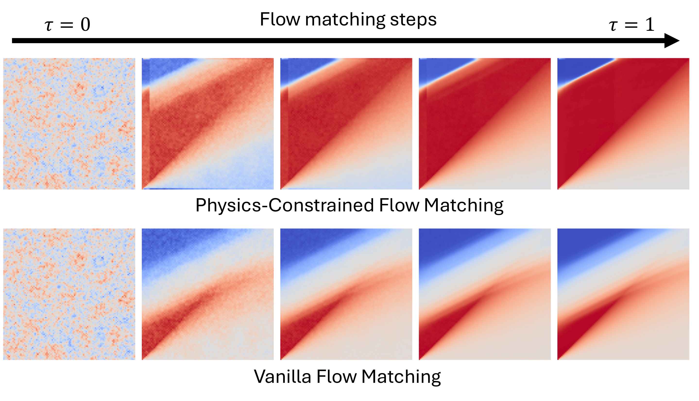

# PCFM: Physics-Constrained Flow Matching
<div align="center">

[](https://arxiv.org/abs/2506.04171)
&nbsp;•&nbsp;
[Project Page](https://caipengfei.me/pcfm)
&nbsp;•&nbsp;
[Julia Version](https://github.com/utkarsh530/PCFM.jl)

</div>

<div align="center">
  
[**Utkarsh\***](https://www.linkedin.com/in/utkarsh530/) •
[**Pengfei Cai\***](https://www.linkedin.com/in/pengfei-cai/) •
Alan Edelman •
Rafael Gómez-Bombarelli •
Christopher Rackauckas  

<em>*To appear at <a href="https://neurips.cc/virtual/2025/poster/117071">NeurIPS 2025</a>.*</em>
</div>

This repo implements *Physics-Constrained Flow Matching (PCFM)* -- a framework that enforces physical constraints in PDE settings with flow-based generative models. 


<div align="center">

</div>


## License

PCFM is released under the **MIT License**.

This repository includes components derived from  
[amazon-science/ECI-sampling](https://github.com/amazon-science/ECI-sampling)  
licensed under the **Apache License 2.0**.  
See [`LICENSE`](./LICENSE), [`LICENSE-APACHE-2.0`](./LICENSE-APACHE-2.0), and [`NOTICE`](./NOTICE) for details.


## Citation

If you use this repository, please cite:

```bibtex
@article{PCFM2025,
  title={Physics-Constrained Flow Matching: Sampling Generative Models with Hard Constraints},
  author={Utkarsh, Utkarsh and Cai, Pengfei and Edelman, Alan and Gomez-Bombarelli, Rafael and Rackauckas, Christopher Vincent},
  journal={arXiv preprint arXiv:2506.04171},
  year={2025}
}
